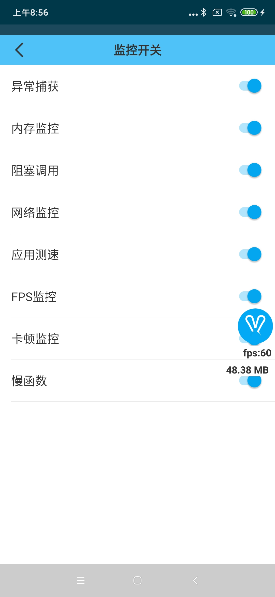

# Rabbit使用文档

>version : 1.0.0-alpha15

**目前仅支持迁移到androidx的项目**

## 文档索引

- [应用测速](./speed-monitor.md)
- [慢函数检测](./slow-method-monitor.md)
- [代码扫描](./block-code-monitor.md)
- [网络日志监控](./net-log-monitor.md)
- [卡顿日志监控](./block-log-monitor.md)
- [FPS和内存监控](./memory-fps-monitor.md)
- [异常与内存泄漏捕获](./exception-leak.md)
- [apk包分析](./app-analyzer.md)
- [接入自定义业务面板](./custom-page.md)
- [数据上报](./data-report.md)
- [noop包接入](./noop-document.md)
- [rabbit配置相关](./rabbit-config.md)
- [release文档](./release/release-1.0.md)
- [其他](./others.md)

## 快速使用

>根目录`build.gradle`
```
dependencies {
    classpath "com.susion:rabbit-gradle-transform:${latest-version}"
}
```

>应用build.gradle
```
apply plugin: 'rabbit-tracer' //引入插件, release包不要引入

dependencies {
    implementation "com.susion:rabbit:${latest-version}"
    debugImplementation "com.squareup.leakcanary:leakcanary-android:$2.0-beta-5" //如果使用leakcanary的话，需要引入leakcanary
} 
```

`rabbit`的功能没有经过线上验证, 因此目前只能在`debug`下使用, 可以通过下面的方式来安全引入`rabbit`:

[noop包接入](./noop-document.md)

### 配置rabbit

#### 功能配置

```
Rabbit.init(config)
```

相关支持配置见:[RabbitConfig](https://github.com/SusionSuc/rabbit-client/blob/master/rabbit-base/src/main/java/com/susion/rabbit/base/config/RabbitConfig.kt)。各项配置具体含义会在每个功能的文档中做详细的介绍。

#### 插件配置

rabbit的`gradle`插件目前主要涉及到代码插桩，可以通过下面对插桩做配置:

```
rabbitConfig {
    enable = true  // 是否启动字节码插桩. 状态切换应clean工程
    printLog = true // 编译时打印插桩log
}
```

### 打开rabbit

`rabbit`使用悬浮窗来展示各种监控数据，因此需要申请悬浮窗权限, 不过内部自带了权限申请逻辑, 调用下面方法来打开`rabbit`:

>Rabbit.kt
```
fun open(requestPermission: Boolean = true, activity: Activity)
```

即`Rabbit.open(true, this)`, 这个方法会主动申请悬浮窗权限。如果有权限的话会打开`rabbit`浮标:


点击`rabbit`浮标即可打开`rabbit`主面板:


**可以通过再次点击`rabbit`浮标来关闭`rabbit`浮窗。**

### 监控开关配置

#### 通过代码配置

可以通过代码来配置`rabbit`各项监控的打开与否:

```
val autoOpenMonitors = hashSetOf(RabbitMonitorProtocol.NET.name, RabbitMonitorProtocol.EXCEPTION.name)

rabbitConfig.monitorConfig.autoOpenMonitors.addAll(autoOpenMonitors)

Rabbit.config(rabbitConfig)
```
>上面配置会自动打开**网络日志监控**和**异常日志监控**功能

#### UI配置

当然也可以在UI浮窗中配置各项功能打开与否。点击**监控配置**即可看到具体功能配置页面:




