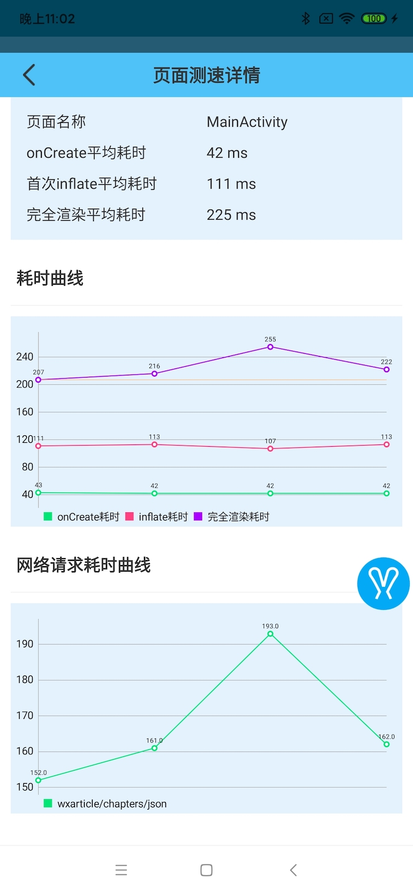
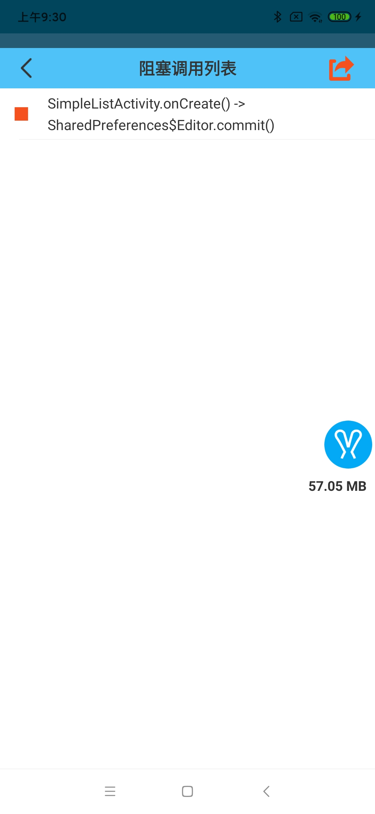
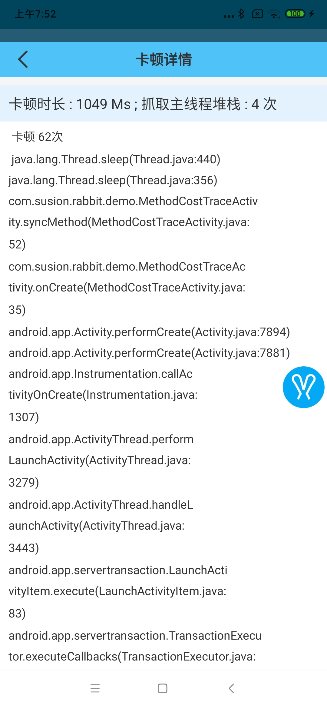
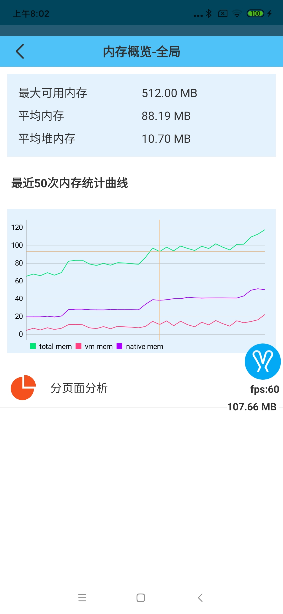
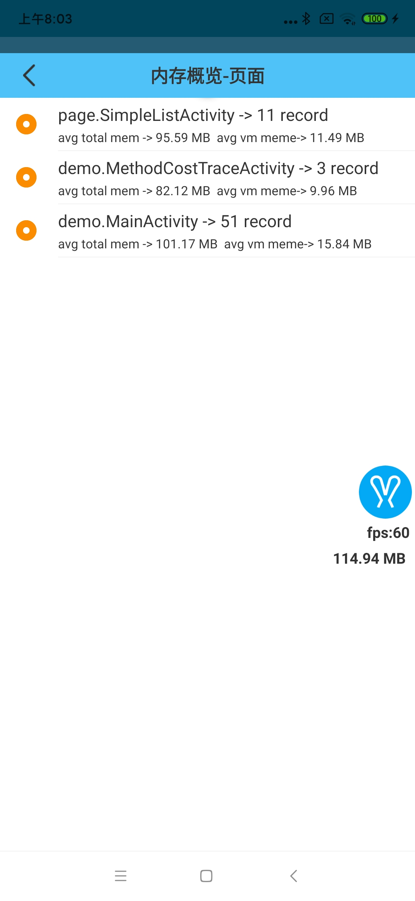

**rabbit**是一个`Android APM`框架, 它不仅可以让开发者很方便的在本地对App做性能监控,也提供了完整的数据上报系统。

`rabbit`项目地址 : https://github.com/SusionSuc/rabbit-client

本文将对`rabbit`的功能做一个简单的介绍,详细的使用文档地址为[使用文档]((https://github.com/SusionSuc/rabbit-client/blob/master/documents/README.md))

>多图警告⚠️⚠️⚠️

`rabbit`目前包含的功能如下图:


# 功能介绍

## 应用测速

通过编译时代码插桩, `rabbit`可以非常方便的统计应用的冷启动时间与页面渲染时间。测速统计的关键时间点定义如下图:


## 应用启动耗时统计

在对应用主页进行配置后,`rabbit`可以统计出如下图所示的冷启动耗时:


## 页面渲染与网络请求耗时统计

与网络请求耗时结合后，`rabbit`可以统计出一个页面的完全渲染耗时。这里的完全渲染耗时是指**从页面create到页面拿到请求结果并刷新页面所用的时间**，核心思想参考自:[Android自动化页面测速在美团的实践](https://tech.meituan.com/2018/07/12/autospeed.html)。最终统计的页面耗时如下图所示:



## 慢函数检测

基于编译时代码插桩, rabbit可以准确的统计每一个函数的耗时，并筛选出**慢函数**。

>慢函数这里定义为**在主线程消耗时间超过一定阈值的函数**(当然rabbit也支持配置检测其他线程的慢函数)。

rabbit支持分包检测慢函数:


支持查看每一个包下的慢函数列表以及每一个慢函数的堆栈:


## 代码扫描

通过提供给`rabbit`一份代码扫描列表, rabbit可以扫描出这些代码调用的位置。rabbit默认会扫描一些阻塞代码, 比如下面这种:

```
SharePreferences$Editor.commit()
```

最终扫描结果会展示如下:



## 网络日志监控

rabbit可以记录网络请求日志并方便的查看返回的`json`数据:


## 卡顿日志监控

rabbit通过`Choreographer`来检测主线程的运行情况,并异步采集主线程堆栈来还原卡顿现场。

对于下面代码:

```
mBlockTv.setOnClickListener {
    Thread.sleep(2000)
}
```

rabbit会获得如下的卡顿采集结果:



## FPS分析

rabbit会在主线程looper运行时计算主线程FPS并实时的显示出来:


rabbit支持分页面分析FPS:


## 内存分析

功能类似于`FPS分析`,rabbit支持实时显示内存使用情况并分页面分析内存占用情况:



分页面内存统计:



## 异常捕获

通过设置`Thread.setDefaultUncaughtExceptionHandler`,rabbit可以捕获java层异常并展示出来:


## 内存泄漏捕获

rabbit集成了`leakcanary 2.0`。

## apk包分析

rabbit提供了一个可执行的jar包, 它可以准确的分析出apk中的大图、重复文件、apk包大小与内容组成。核心思路参考自[Matrix APK包分析](https://github.com/Tencent/matrix/wiki/Matrix-Android-ApkChecker)。

运行方式为:

```
java -jar apk-analyzer.jar apk-analyzer-config.json
```

`apk-analyzer-config.json`用来配置待分析的apk路径以及mapping文件位置等信息:

```
{
    "apkPath":"xxxx/app-Release.apk",
    "methodGroup":[{
        "name":"xxx",
        "package":"com.xxx.xx"
    }],
    "classMappingFilePath":"xxx/Desktop/apk-analyzer/apk-analyzer-config.json",
    "maxImageSizeKB":30
}
```

最终分析结果会输出到一个json文件中:

>apk-analyzer-result.json
```
{
    "AppInfo": {
        "versionCode": "1004000",
        "versionName": "1.4.0",
        "appSize": "21.51 MB"
    },
    "BigImageRes": [
        {
            "name": "assets/flutter_assets/images/icons/xxLogo.png",
            "size": "76.73 KB"
        }
        ...
        ...
    ],
    "ApkCompose": [
        {
            "type": "so",
            "totalSizeStr": "8.05 MB"
        },
        {
            "type": "dex",
            "totalSizeStr": "6.54 MB"
        }
        ...
        ...
    ],
    "DuplicatedFile": [
        {
            "files": [
                "res/drawable-xxhdpi-v4/bg_home_water_ripple.webp",
                "res/drawable-xxhdpi-v4/bg_keyboard_shadow_line.webp"
            ],
            "fileSize": "",
            "md5Value": "d41d8cd98f00b204e9800998ecf8427e"
        }
        ....
    ],
    "MethodCount": {
        "total-count": 127732,
        "com.xxx.xx": 14800,
        "other-pkg": 112932
    }
}
```

## 自定义面板

rabbit向外提供了`UI`扩展API,使用这些API可以很方便的把应用的“后门“放到rabbit中。

具体操作见 : [在rabbit中自定义页面](https://github.com/SusionSuc/rabbit-client/blob/master/documents/custom-page.md)


## 数据上报

rabbit目前支持上报大部分检测数据。通过一些简单的配置就可以把检测数据上报到后台。rabbit数据上报的基本格式如下:

```
{
    "deviceInfoStr": "{....}",
    "infoStr": "{...}",
    "time": 1577775888933,
    "type": "fps_info",
    "useTime": 19
}
```

- type : 上报的数据类型
- deviceInfoStr : 设备信息, 格式json字符串
- infoStr: 该类型的数据的具体内容, 格式为json字符串
- useTime: 应用当前使用时长

**rabbit提供了上报回调,可以通过这个回调很方便的来实现自定义的上报逻辑。**

# 可用性与可配置性

对于每一个功能,rabbit都提供了丰富的配置API,详细配置见具体功能的使用文档。

在rabbit控制面板中你也可以很方便的控制这些功能:

>监控开关设置


>快捷功能


>查看当前配置


# noop包

rabbit目前没有经过线上环境的验证，为了方便接入，提供了noop包。

具体引入步骤见[引入noop包](https://github.com/SusionSuc/rabbit-client/blob/master/documents/noop-document.md)

# 后续开发计划

## 完善现有功能

rabbit目前提供的功能还是比较简单的,接下来会更细致的完善每一个功能来提高可用性。

## 性能测量模式

rabbit会利用现有的功能来做一个全局的性能检测并输出一个检测分数来评估应用的性能。具体实现逻辑我还在思考中。

## 管理后台

客户端功能做的比较完善后，计划做一个性能监控后台。

# 贡献代码

rabbit目前维护者只有我一个人。 一个人的力量终究有限, 如果你对rabbit有兴趣或者感觉哪些功能不完善,欢迎提pr来加入到rabbit的开发中！

# 最后

既然都看到这里了, 给[Rabbit](https://github.com/SusionSuc/rabbit-client)个✨吧! 奥利给!

再推广一下我的个人公众微信号:


# 参考资料

[booster](https://github.com/didi/booster)

[matrix](https://github.com/Tencent/matrix)

[DoraemonKit](https://github.com/didi/DoraemonKit)

[ArgusAPM](https://github.com/Qihoo360/ArgusAPM)

[fpsviewer](https://github.com/SilenceDut/fpsviewer)

[JsonViewer](https://github.com/smuyyh/JsonViewer)

[AndroidPerformanceMonitor](https://github.com/markzhai/AndroidPerformanceMonitor)

[...](https://github.com/SusionSuc/rabbit-client)